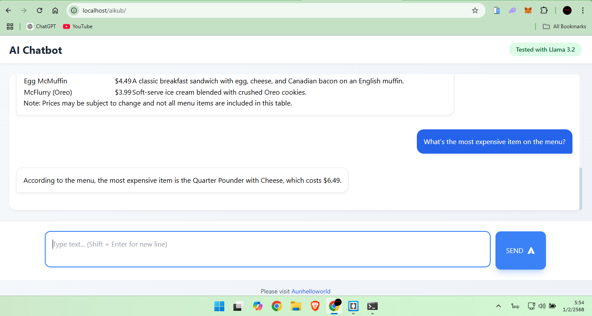

## Installation Guide

   Follow the steps below to set up **Ollama Chatbot Web** on your machine:

### 1. Install Ollama
   Start by installing **Ollama** on your machine. You can download it from the official Ollama website:  
[Download Ollama](https://ollama.com/)

### 2. Install a Model
   After installing Ollama, you need to select and install a model. Go to the [Ollama Models Page](https://ollama.com/models), choose a model, and install it by running the following command in your terminal (example below):
**ollama run llama3.2**

   If you ever need to remove a model, you can use the command:
**ollama rm llama3.2**

### 3. Install Laragon or XAMPP
   To host the chatbot locally, install Laragon or XAMPP. These tools will allow you to run a local server and access the chatbot interface via:
http://localhost

### 4. Place Files in the Web Directory
   Copy the following files into your web server’s root directory (e.g., www folder in Laragon or XAMPP):

**index.php**
**chat.php**
**styles.css**

### 5. Modify chat.php File
   Open the chat.php file and find line 17 where the model is specified. By default, it should look like this:
**"model" => "llama3.2"**

You can replace "llama3.2" with the name of the model you want to use, for example, llama3.2 or any other available model.

In version 1.1 onwards, users can enable or disable the use of the prompt in the chat.php file. When enabled, the AI will answer questions based on the provided prompt, making the answers more specialized. If disabled, the AI will respond using general information without the prompt.
You can control this behavior by setting the $usePrompt variable to true or false in the chat.php file, as shown below:
### $usePrompt = $data["use_prompt"] ?? true;  // Set to true to use prompt, false to disable it

When '$usePrompt' is set to 'true', the AI will respond based on the prompt. When set to 'false', the AI will use other information and not rely on the prompt for its answers.

### 6. Test the Chat Interface
   Once you’ve completed the setup, go to http://localhost/index.php to test the chatbot. The chat.php file will handle all communication with the Ollama API to provide the AI chatbot functionality.

By following these simple steps, you will have a fully functional chatbot running on your local machine, powered by Ollama’s AI models.
